网安2201
常兆鑫
2226114409

---

# 📡 DockRat – 多级中继式远程控制平台

DockRat 是一个支持多级 relay 拓扑结构的远程控制平台，采用 Go 语言开发，具备轻量、模块化、高可控等特性，适用于安全研究、远程维护、远程执行等场景。

>  支持直连与 relay 模式
>  支持端口转发、shell、文件传输、反向连接
>  控制命令清晰易用
>  拓扑结构可视化

---

## 一、 当前支持功能（截至 2025-07）

### 1 节点管理

* 支持多节点注册（直连 / relay 模式）
* `startrelay <id> <port>`：启动 relay 功能，子节点从此连接
* `topo`：可视化打印当前节点拓扑结构

### 2 Shell 功能

* `shell <id>`：启动交互式 shell
* 保持持久上下文（支持 cd / export 等）
* 支持多层 relay shell 透传

### 3 文件上传下载

* `upload <id> <local> <remote>`：上传文件
* `download <id> <remote> <local>`：下载文件（支持大文件分片）

### 4 端口转发

* **正向转发（forward）**
  `forward <id> <local_port> <target_host:port>`
  建立从 admin 本地端口 → agent → 内网目标的通道

* **反向转发（backward）**
  `backward <id> <agent_listen_port> <admin_target>`
  agent 监听端口，admin 主动连接后转发至目标服务

*  已支持：

  * relay 子节点 forward + backward(relay子节点backward功能不稳定)
  * 直连节点 forward + backward


### 5 连接控制指令

* `forward_stop <connID>`：关闭指定 forward 通道
* `backward_stop <connID>`：关闭指定 backward 通道
* `list_forward`：查看当前 forward 通道状态
* `list_backward`：查看当前 backward 通道状态


## 二、 实际运行截图
- 运行环境：Go 1.20+，Linux x86_64
- 节点说明：均位于本机的不同目录下，可以在shell N时看到明显差异

### 1、节点注册与拓扑展示

```
❯ go run cmd/admin/main.go
2025/07/04 16:12:28 [+] Admin starting...
(admin) >> 2025/07/04 16:12:28 [+] Listening on :9999
2025/07/04 16:12:30 [+] New connection from 127.0.0.1:44456
2025/07/04 16:12:30 [+] Registered agent ID 0 - doraemon@xxx (linux)
(admin) >> topo
[+] Node Topology:
|- Node[0] doraemon@xxx (linux)
(admin) >> startrelay 0 9998
[+] Sent startrelay to node 0, range = [1 ~ 999]
(admin) >> 2025/07/04 16:13:02 [Relay Ready] Node -1 (:9998) is now acting as relay 
(admin) >> 2025/07/04 16:13:07 [+] Registered relayed node ID 1 under parent 0
(admin) >> topo
[+] Node Topology:
|- Node[0] doraemon@xxx (linux)
  |- Node[1] doraemon@xxx (linux)
(admin) >> 
```


- admin

- agent0(relay)
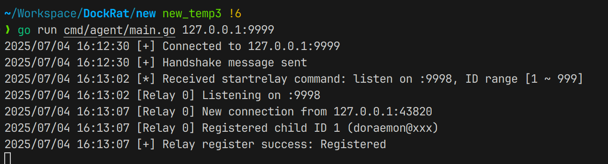
- agent1
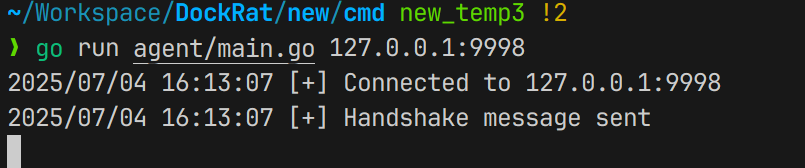

---

### 2、Shell 执行与交互

```
(admin) >> shell 1
[+] Shell started. Type commands (type 'exit' to quit):
remote$ ls
admin  agent  upload
```

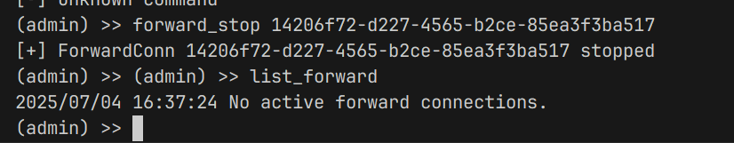

---

### 3、Forward 转发成功使用 SSH 登录
测试admin为悬挂在agent0上的agent1开启22-ssh端口的forward指令


- admin节点指令
  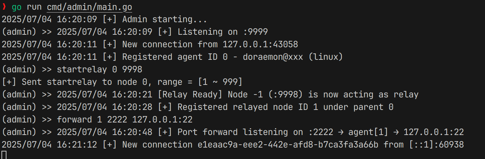

- agent0节点console
  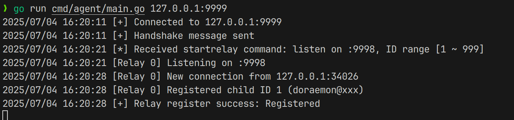
- agent0节点console
  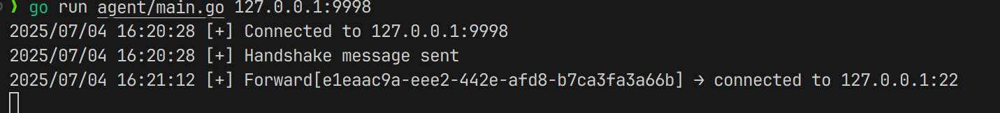
- agent1节点SSH登录成功
  

### 4、backward 转发成功使用 SSH 登录
测试admin为悬挂在agent0上的agent1开启22-ssh端口的forward指令


- admin节点指令
  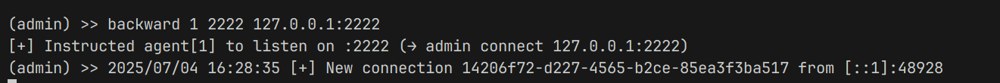

- agent0节点console
  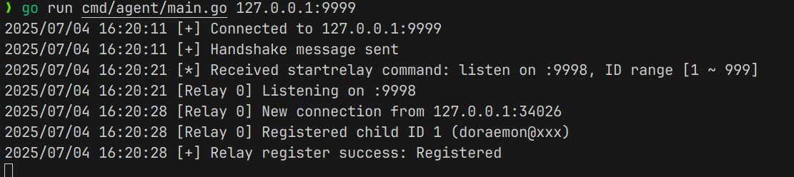
- agent0节点console
  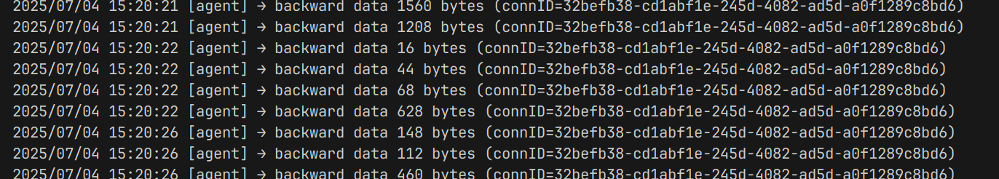
- agent1节点SSH登录成功
  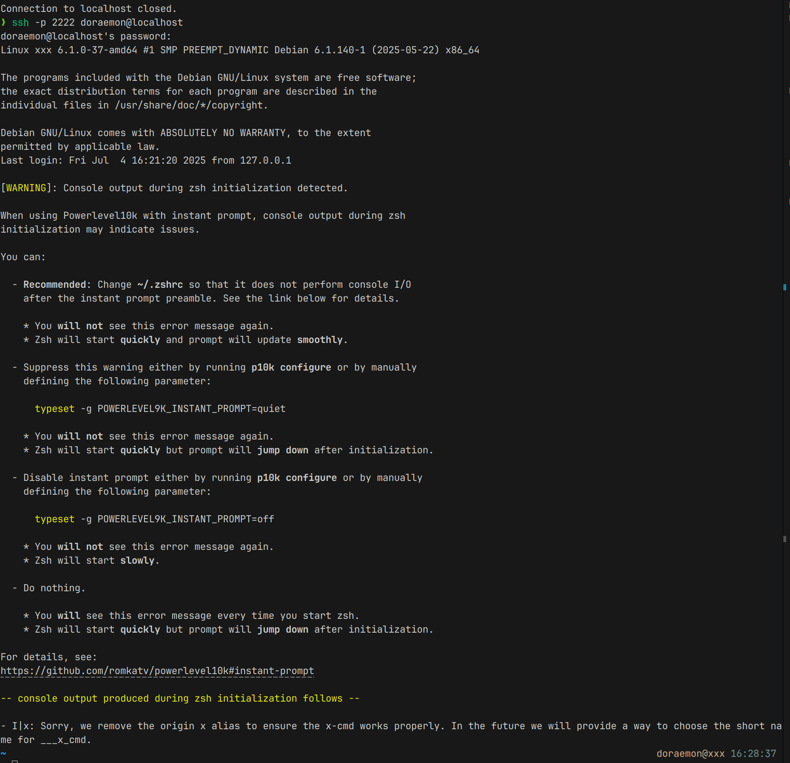


### 5 list/stop forward/backward 控制指令,以forward为例

- list_forward
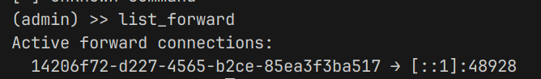
- forward_stop


## 三 系统架构图

### 1、总架构图

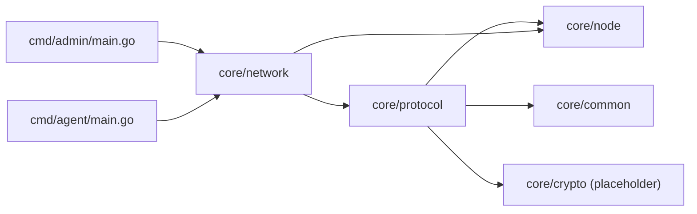

### 2、admin程序模块调用关系
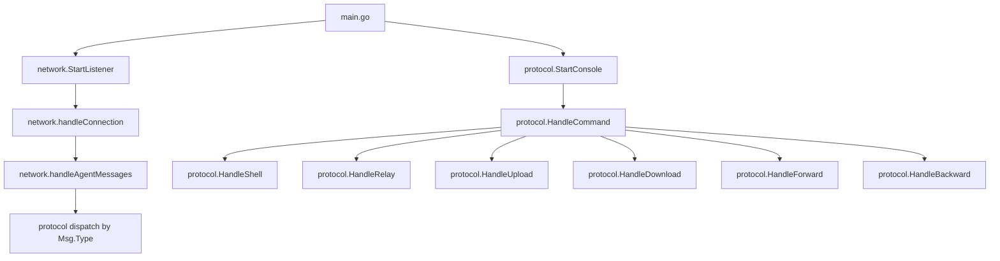

### 3、relay功能执行流程图
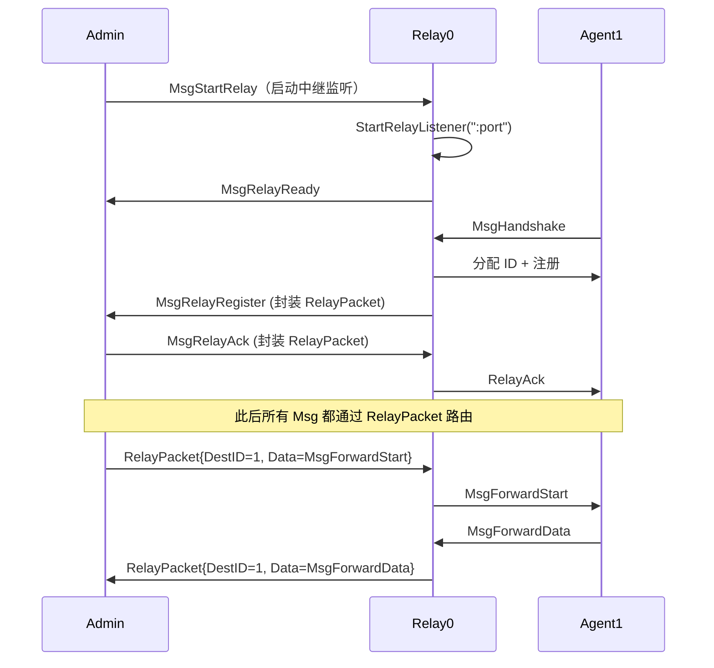

### 4、forward功能执行流程图
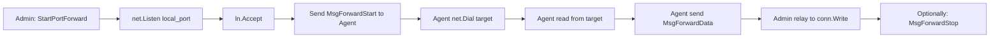
### 5、backward功能执行流程图
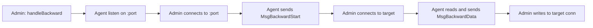


## 四 项目结构
```
.
├── assets/                          # 静态资源目录（用于README展示）
│
├── cmd/                             # 应用程序入口目录
│   ├── admin/                       # 控制端 Admin 程序
│   │   └── main.go                  # 启动控制台 + 监听 agent 连接
│   └── agent/                       # 被控端 Agent 程序
│       └── main.go                  # 启动并连接到 admin，注册身份
│
├── core/                            # 项目核心功能模块
│   ├── common/                      # 公共工具与配置模块
│   │   ├── config.go                # （预留）配置加载逻辑
│   │   ├── id_allocator.go          # Relay 子节点 ID 分配器
│   │   └── logger.go                # （预留）日志统一处理
│
│   ├── network/                     # 网络连接与协议调度模块
│   │   ├── connection.go            # Admin 端连接接入与消息分发
│   │   ├── dispatcher.go            # Agent 端消息分发与执行处理
│   │   ├── relay.go                 # Relay 中继节点监听与转发处理
│   │   └── utils.go                 # 通用辅助函数（如字节转整数）
│
│   ├── node/                        # 节点管理与拓扑结构维护模块
│   │   ├── registry.go              # 节点注册/查找/移除（包含 PrintTopology）
│   │   └── topology.go              # 多级 Relay 节点拓扑结构图维护
│
│   └── protocol/                    # 协议定义与命令处理逻辑模块
│       ├── backward.go              # backward 模式（agent → admin）传输实现
│       ├── command.go               # 控制台命令处理（如 upload、topo、shell）
│       ├── file_transfer.go         # 下载文件的文件接收器（download）
│       ├── forward.go               # forward 模式（admin → agent）传输实现
│       ├── message.go               # 协议消息结构与类型定义
│       └── ui.go                    # 控制台提示符打印逻辑
│
├── pkg/                             # 外部扩展/第三方封装代码目录（预留）
│
├── go.mod                           # Go 模块定义与依赖声明
├── go.sum                           # Go 模块依赖版本校验文件
│
├── README.md                        # 📘 项目说明文档
└── Report.md                        # 📄 项目设计与阶段性报告（课设/实验用）
```

## 五、 依赖要求

* Go 1.20+
* 仅使用标准库 + `github.com/google/uuid` + `github.com/creack/pty v1.1.24`


## 六、 下一步可拓展方向

* 支持 relay 子节点 backward；
* 支持文件目录操作；
* 支持 agent 端启动服务自动上线；
* 支持 Web UI 控制台（未来版本）；
* 支持 Debug log 动态开关；

## 七、DockRat 在网络安全中的典型应用场景


### 1.  **红队渗透测试（Red Team）**

在攻防演练或授权渗透测试中，红队通常需要：

* **从跳板机访问目标内网节点**；
* **横向移动到多个层级的子网**；
* **反弹 shell 或控制内网服务**。

> **DockRat 的 relay + backward + forward 特性非常适用于此类需求：**

* `forward`：将 admin 本地端口映射至目标 agent，可以访问目标内网服务（如内网 SSH、数据库等）；
* `backward`：允许内网 agent 监听端口，将连接反向送回 admin，实现“反弹”控制；
* `startrelay`：允许一个 agent 作为 relay 中继，支撑多跳连接穿透复杂拓扑。


```
admin$ startrelay 0 9998     // Agent 0 成为 relay
admin$ backward 2 2222 127.0.0.1:3389
admin$ forward 3 1080 127.0.0.1:445
```


### 2.  **安全工具链构建与协议实验**

该项目支持自定义多种消息类型与转发机制，适用于构建**协议测试平台**或**控制通道原型**。

可用于：

* 演示 TCP 隧道如何构建；
* 实现 C2（Command & Control）通道原型；
* 验证 relay 栈中的消息封装与多级透传机制；
* 测试反向连接可靠性与稳定性。


### 3.  **内网控制与分布式代理测试**

* 模拟 **僵尸网络通信架构**；
* 管理多个 agent 节点，发送命令并统一查看回显；
* 测试数据流量的透明中继、流量追踪能力；
* 用于开发**自定义分布式转发网关**系统。


### 4.  **恶意行为研究与蜜罐诱捕**

DockRat 的特性类似于某些真实恶意控制器（如 Cobalt Strike Beacon）：

* 多级 relay；
* 文件上传/下载；
* 可动态注入新模块（如未来支持 socks5）；

> 因此也适用于**研究恶意流量特征**、**构建仿真蜜罐环境**。


