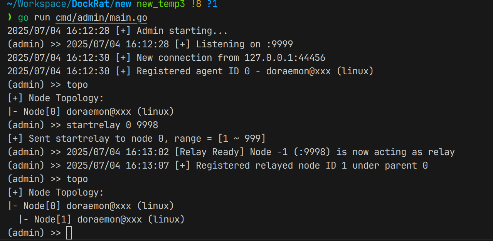

网安2201
常兆鑫
2226114409

---

# 📡 DockRat – 多级中继式远程控制平台

DockRat 是一个支持多级 relay 拓扑结构的远程控制平台，采用 Go 语言开发，具备轻量、模块化、高可控等特性，适用于安全研究、远程维护、远程执行等场景。

> ✅ 支持直连与 relay 模式
> ✅ 支持端口转发、shell、文件传输、反向连接
> ✅ 控制命令清晰易用
> ✅ 拓扑结构可视化

---

## 🔧 当前支持功能（截至 2025-07）

### ✅ 节点管理

* 支持多节点注册（直连 / relay 模式）
* `startrelay <id> <port>`：启动 relay 功能，子节点从此连接
* `topo`：可视化打印当前节点拓扑结构

### ✅ Shell 功能

* `shell <id>`：启动交互式 shell
* 保持持久上下文（支持 cd / export 等）
* 支持多层 relay shell 透传

### ✅ 文件上传下载

* `upload <id> <local> <remote>`：上传文件
* `download <id> <remote> <local>`：下载文件（支持大文件分片）

### ✅ 端口转发

* **正向转发（forward）**
  `forward <id> <local_port> <target_host:port>`
  建立从 admin 本地端口 → agent → 内网目标的通道

* **反向转发（backward）**
  `backward <id> <agent_listen_port> <admin_target>`
  agent 监听端口，admin 主动连接后转发至目标服务

* ✅ 已支持：

  * relay 子节点 forward
  * 直连节点 forward + backward

* ❌ 未支持：relay 子节点 backward（已知问题）

### ✅ 连接控制指令

* `stopforward <connID>`：关闭指定 forward 通道
* `stopbackward <connID>`：关闭指定 backward 通道
* `listforward`：查看当前 forward 通道状态
* `listbackward`：查看当前 backward 通道状态

---

## 🖥️ 实际运行截图


### 节点注册与拓扑展示

```
❯ go run cmd/admin/main.go
2025/07/04 16:12:28 [+] Admin starting...
(admin) >> 2025/07/04 16:12:28 [+] Listening on :9999
2025/07/04 16:12:30 [+] New connection from 127.0.0.1:44456
2025/07/04 16:12:30 [+] Registered agent ID 0 - doraemon@xxx (linux)
(admin) >> topo
[+] Node Topology:
|- Node[0] doraemon@xxx (linux)
(admin) >> startrelay 0 9998
[+] Sent startrelay to node 0, range = [1 ~ 999]
(admin) >> 2025/07/04 16:13:02 [Relay Ready] Node -1 (:9998) is now acting as relay 
(admin) >> 2025/07/04 16:13:07 [+] Registered relayed node ID 1 under parent 0
(admin) >> topo
[+] Node Topology:
|- Node[0] doraemon@xxx (linux)
  |- Node[1] doraemon@xxx (linux)
(admin) >> 
```


- admin

- agent0(relay)

- agent1


---

### Shell 执行与交互

```
(admin) >> shell 1
[+] Shell started. Type commands (type 'exit' to quit):
remote$ ls
admin  agent  upload
```


📷 示例插图：


---

### Forward 转发成功使用 SSH 登录

📷 示例插图：


---

### list/stopforward 控制指令示例

```
(admin) >> listforward
Active forward connections:
  f5bd3c79-f2ba-4aa2-9b90-885f4a6bfd83 → 127.0.0.1:22

(admin) >> stopforward f5bd3c79-f2ba-4aa2-9b90-885f4a6bfd83
[+] ForwardConn f5bd3c79-f2ba-4aa2-9b90-885f4a6bfd83 stopped
```

📷 示例插图：


---

## 🧱 系统架构图

### 1、总架构图


### 2、admin程序模块调用关系


### 3、relay功能执行流程图


### 4、forward功能执行流程图

### 5、backward功能执行流程图


---

##  项目结构（简略）
```
.
├── assets/                          # 静态资源目录（用于README展示）
│
├── cmd/                             # 应用程序入口目录
│   ├── admin/                       # 控制端 Admin 程序
│   │   └── main.go                  # 启动控制台 + 监听 agent 连接
│   └── agent/                       # 被控端 Agent 程序
│       └── main.go                  # 启动并连接到 admin，注册身份
│
├── core/                            # 项目核心功能模块
│   ├── common/                      # 公共工具与配置模块
│   │   ├── config.go                # （预留）配置加载逻辑
│   │   ├── id_allocator.go          # Relay 子节点 ID 分配器
│   │   └── logger.go                # （预留）日志统一处理
│
│   ├── network/                     # 网络连接与协议调度模块
│   │   ├── connection.go            # Admin 端连接接入与消息分发
│   │   ├── dispatcher.go            # Agent 端消息分发与执行处理
│   │   ├── relay.go                 # Relay 中继节点监听与转发处理
│   │   └── utils.go                 # 通用辅助函数（如字节转整数）
│
│   ├── node/                        # 节点管理与拓扑结构维护模块
│   │   ├── registry.go              # 节点注册/查找/移除（包含 PrintTopology）
│   │   └── topology.go              # 多级 Relay 节点拓扑结构图维护
│
│   └── protocol/                    # 协议定义与命令处理逻辑模块
│       ├── backward.go              # backward 模式（agent → admin）传输实现
│       ├── command.go               # 控制台命令处理（如 upload、topo、shell）
│       ├── file_transfer.go         # 下载文件的文件接收器（download）
│       ├── forward.go               # forward 模式（admin → agent）传输实现
│       ├── message.go               # 协议消息结构与类型定义
│       └── ui.go                    # 控制台提示符打印逻辑
│
├── pkg/                             # 外部扩展/第三方封装代码目录（预留）
│
├── go.mod                           # Go 模块定义与依赖声明
├── go.sum                           # Go 模块依赖版本校验文件
│
├── README.md                        # 📘 项目说明文档
└── Report.md                        # 📄 项目设计与阶段性报告（课设/实验用）
```
---

## 📦 依赖要求

* Go 1.20+
* 仅使用标准库 + `github.com/google/uuid` + `github.com/creack/pty v1.1.24`


---

## ✅ 下一步可拓展方向

* 支持 relay 子节点 backward；
* 支持文件目录操作；
* 支持 agent 端启动服务自动上线；
* 支持 Web UI 控制台（未来版本）；
* 支持 Debug log 动态开关；

---

